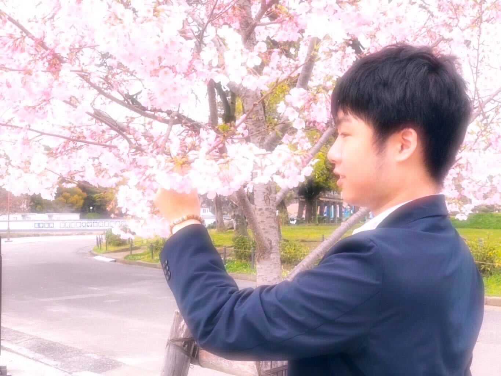

# achievements

<!DOCTYPE html>
<html>
<head>
    <meta charset="utf-8">
    <meta name="viewport" content="width=device-width, initial-scale=1">
    <title>achievements</title>
    <link rel="stylesheet" type="text/css" href="style.css">
</head>
<body id="">
    <nav>
        
　こちらのポートフォリオはhtmlとcss、javascript（jquery）、…を使用しな がら制作しました。そうしたときに、就職活動をする上で、私自身が自己紹介を するためのポートフォリオをご用意することを予定して本ポートフォリオを制作致 しました。

        
achievements

        <ul class="navthree">

            <!-- ポートフォリオについての説明をpタグを用いて書く。 -->

            <li class="navstu">学生時代</li>
            <li class="navtra">トレーニング</li>
            <li class="navdre">夢</li>
        </ul>
    </nav>
    

        <h3>学生時代</h3>
        
        
　私は静岡英和学院大学を卒業しました。大学生時代には エンジニア
            になるためにパソコンの学習をしながら学習を しておりました。
            左側の写真は私がこれから社会に出て働 くことを踏まえて、静岡県の
            駿府公園で撮った写真です。 私はエンジニアとして活躍していくこと
            を夢に現在頑張って います。

    

    

        <h3>トレーニング</h3>
        
　私は１６歳の頃からトレーニングをしています。忙しい時期以外は、
            週に2回あるいは3回の ペースで通いながらトレーニングの部屋を利
            用しながら私自身の鍛錬に励んでいました。ト レーニングを継続的
            に行うことによって、周囲の人から認めていただけたり、自信を持つこと ができたりしますので、今後一層続けていきたいです。トレーニングは、心も頭も良くする効 果があります。私は将来、プロのレベルまでトレーニングを上達させたいと思っています。

        
 こちらは[ライザップ牛サラダ]と言います。高いたん ぱくと糖質が低いボリュームいっぱいのサラダです。 牛肉だけでなく、鶏肉・ブロッコリー・半熟玉子と バランスよくたんぱく質を摂取できます。私はこち らの商品をトレーニング後によく食べていました。

        
    

    

        <h3>夢</h3>
        
こちらは私が１９歳から２０歳になったことを機に プログラミング言語の学習をスタートしたときに 撮った沖縄県の美浜という地域から撮った海です。

        
        <ul>
            <li>[私が叶えたい夢]</li>
            <li>優秀なエンジニアとして活躍すること</li>
            <li>色々なエンジニアの人と仲良くなること</li>
            <li>家族と親戚を幸せにすること</li>
            <li>お金持ちになること</li>
            <li>車を買うこと</li>
            <li>日本と外国に複数件の別荘を持つこと</li>
            <li>トレーニングをすること</li>
            <li>見た目が良い男性になること</li>
            <li>１ヶ月に１０冊の読書ができるようになること</li>
        </ul>
    

    <footer>
        <h2>@Takumi.achivements</h2>
        <a class="one-more" href="https://takumi212.github.io/myprofile/">クリックするともう一枚の ポート
            フォリオに変わります。</a>
    </footer>
</body>
</html>
